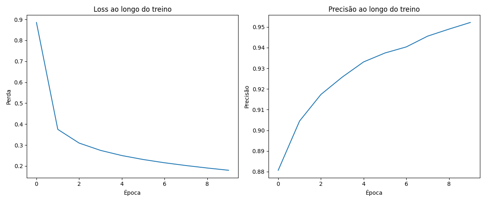
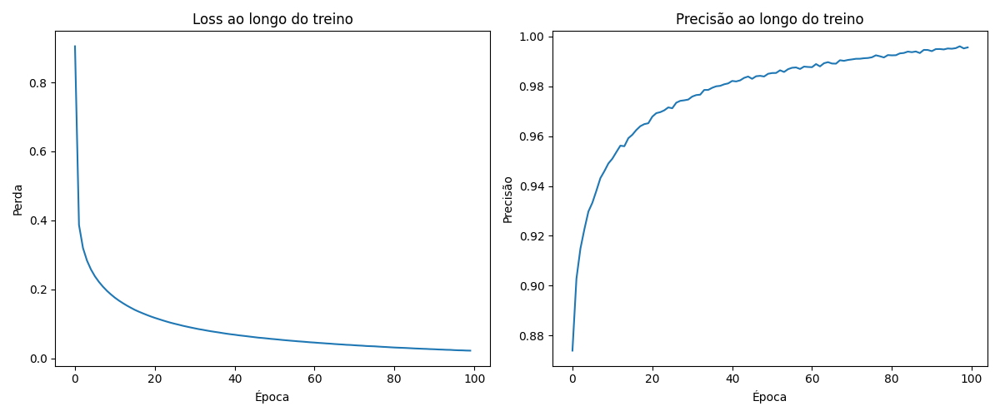
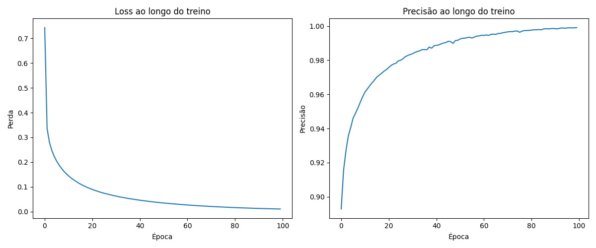
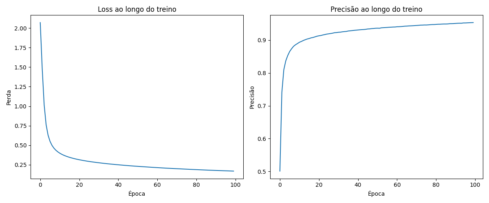
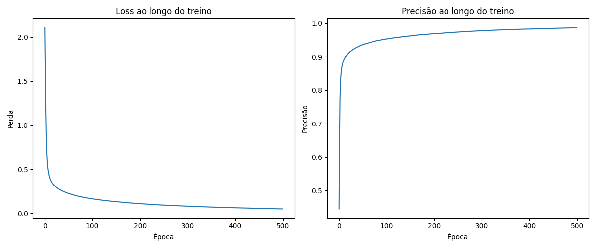

# MLP do Zero

Implementação em Python de um percéptron com duas camadas ocultas sem utilizar bibliotecas externas, apenas funções de cálculo básicas do NumPy.

A implementação atual utiliza o dataset MNIST para treinamento e execução.

# Instruções de Execução

## Requisitos:

- Python3
- NumPy
- Tensorflow (Para importar dataset MNIST)
- Matplotlib

**Opcional: Crie um ambiente virtual para executar a aplicação** 
```bash
python -m venv venv

# (Windows)
/.venv/Scripts/Activate.ps1

# (Linux)
source .venv/Scripts/activate
```

Instale as dependências de bibliotecas de Python (se já não possuir elas)
```bash
pip install -U numpy tensorflow matplotlib

# OU

pip install -r requirements.txt
```

Feito isso, clone o repositório. Você já pode executar o pacote na raiz dele usando o seguinte comando:
```bash
python -m mlp --help
```

Fazendo isso, você verá instruções dos possíveis argumentos de execução que você pode customizar:

- --epochs: determinar o número de épocas (padrão: 100 épocas)
- --batch-size: determinar o tamanho do batch de treinamento (padrão: 64)
- --lr: determinar a taxa de aprendizado (padrâo: 0.01)
- --hidden1 e --hidden2: determinar a quantidade de neurônios em cada camada (padrão: 64 e 32, respectivamente)
- --plot-history: abre plot com gráficos da perda e precisão ao longo do aprendizado (esse arquivo é gerado e salvo por padrão independente desse parâmetro)

Exemplo de execução: 
```bash
python -m mlp --epochs 500 --lr 0.001 --hidden1 128 --hidden2 64
```

Após o treinamento do modelo, os resultados serão salvos dentro de uma subpasta em *results/run_(data atual)_(hora_atual)*.

# Estrutura de Arquivos

```
.
├── README.md              ← este arquivo
├── mlp/
│   ├── __init__.py
│   ├── network.py         ← implementação do MLP
│   ├── activations.py     ← funções de ativação ReLU e softmax 
│   ├── losses.py          ← cross-entropy
│   └── optimizers.py      ← SGD
├── notebooks/
│   └── experimentos.ipynb ← notebook utilizado para experimentação
├── results/
│   └── run_(data)_(hora)  ← plots e métricas de uma sessão de treino
└── requirements.txt
```

# Decisões e Dificuldades

A MLP foi desenvolvida com o dataset MNIST em mente, e então devido a natureza do input (imagens 32x32) e output (10 números possíveis) ela foi construída com duas camadas ocultas, com função de ativação ReLU e output com função de ativação softmax. Essa decisão se deu após breve testagem de uma MLP com camadas com função de ativação sigmoide, que acabava explodindo o gradiente e parava de aprender na primeira época. Já a quantidade de neurônios das camadas ocultas (64 e 32, respectivamente) foi selecionada de forma arbitrária, pois são valores customizáveis que eu experimentei trocar depois.

A estrutura do percéptron era inicialmente guardada inteiramente dentro da classe MLP (como visto na versão no notebook). Por ser um modelo simples, era mais fácil gerenciar tudo dentro do mesmo lugar, mas devido às normas de estrutura de repositório da atividade ponderada, partes da lógica foram separadas em diferentes arquivos.

As primeiras iterações foram desenvolvidas no Google Colab (esse sendo o maior motivo pela ausência de commits, muito da testagem ocorreu lá, com o notebook sendo vestígio dessa testagem). Essa decisão acelerou o desenvolvimento, com a execução em nuvem sendo bem veloz e em casos de erro (como overflow de memória, algo que ocorreu várias vezes antes de eu implementar o treinamento em batches), bastava reiniciar a página para retomar o trabalho, e não o computador inteiro!

Algo que tive que fazer para que o uso do dataset fosse possível foi formatar os dados, que são importados como arrays 2D 23x23, e devem ser achatados para serem aceitos no input do MLP, tornando se uma array simples de tamanho 784. Os valores também tiveram que ser normalizados de 0-255 para 0-1. Ademais, devido à natureza de classificação do modelo, tive que realizar One-Hot encoding nas respostas.

Um dos problemas que infelizmente não tive tempo de solucionar foi a implementação de um parâmetro de paciência, ou seja, o modelo apenas cessa o treinamento quando passar por todas as épocas, o que pode levar o treinamento a continuar por muito tempo, mesmo se o modelo já encontrou mínima local ou global. Dito isso, não foi muito relevante para esse dataset, já que uma sessão de treinamento leva poucos minutos, mesmo com centenas de épocas.

# Validação e comparação de resultados

A estrutura selecionada é eficiente e lida muito bem com o dataset MNIST, sendo capaz de rapidamente se ajustar e se generalizar em poucas épocas. Em meus testes, apenas 10 épocas já são suficientes para que o modelo alcance precisão de aproximadamente 95%.

metrics.json:

```json 
{
    "accuracy": 0.9503,
    "final_loss": 0.17955512986722907,
    "epochs": 10,
    "batch_size": 64,
    "learning_rate": 0.01,
    "hidden1": 64,
    "hidden2": 32
}
```



Observa-se no gráfico que a curva de loss desce drasticamente nas primeiras 3 épocas, assim como a curva de precisão sobre bem rapidamente. Nota-se como elas ainda não parecem tender em algum valor, significando que por mais que o resultado seja bom, vale a pena deixar o modelo aprender por mais algumas épocas.

Treinando o percéptron com os mesmos parâmetros, mas por 100 épocas, chegamos numa precisão de aproximadamente 97,3%

metrics.json:

```json 
{
    "accuracy": 0.9731,
    "final_loss": 0.02266527260636444,
    "epochs": 100,
    "batch_size": 64,
    "learning_rate": 0.01,
    "hidden1": 64,
    "hidden2": 32
}
```



O modelo começa a tender cada vez mais na perfeição. É importante destacar que o plot do histórico de precisão é calculado baseado no set de treinamento, e não reflete a precisão verdadeira; o plot tende em precisão de 99%, sinalizando que ele acaba overfittando um pouco, mas considerando precisão de 97% no dataset de validação, não apresenta problema grave nesse dataset em específico.

Treinando o percéptron com os mesmos parâmetros iniciais, 100 épocas, mas com 128 neurônios em ambas camados ocultas, chegamos numa precisão de aproximadamente 97,85%

metrics.json:

```json 
{
    "accuracy": 0.9785,
    "final_loss": 0.010742582429491354,
    "epochs": 100,
    "batch_size": 64,
    "learning_rate": 0.01,
    "hidden1": 128,
    "hidden2": 128
}
```



A performance não impressiona muito, mesmo com maior complexidade o resultado e tendência no treinamento são basicamente iguais. Devido a isso, é mais interessante o modelo mais simples, que foi capaz de alcançar praticamente a mesma precisão, mas é mais eficiente, leva menos tempo para ser treinado, e é menos propenso ao overfitting.

Treinando o percéptron com os mesmos parâmetros iniciais, mas por 100 épocas, e com taxa de aprendizado 0.001, chegamos numa precisão de aproximadamente 95%

metrics.json:

```json 
{
    "accuracy": 0.9509,
    "final_loss": 0.16788166606029392,
    "epochs": 100,
    "batch_size": 64,
    "learning_rate": 0.001,
    "hidden1": 64,
    "hidden2": 32
}
```



Esse resultado demonstra a importância de uma taxa de aprendizado equilibrada. Um valor menor pode ajudar a evitar o problema do desaparecimento de gradiente, mas se o valor ser pequeno demais isso retarda drasticamente o aprendizado do percéptron. Ele foi capaz de alcançar a mesma precisão que o percéptron da execução inicial, mas levou 10 vezes mais tempo, o que condiz com sua taxa de aprendizado ser 10 vezes menor do que a primeira.

Treinando o percéptron com os mesmos parâmetros iniciais, mas por 500 épocas, e com taxa de aprendizado 0.001, chegamos numa precisão de aproximadamente 97,23%.

```json 
{
    "accuracy": 0.9723,
    "final_loss": 0.04997134726149274,
    "epochs": 500,
    "batch_size": 64,
    "learning_rate": 0.001,
    "hidden1": 64,
    "hidden2": 32
}
```



Deixar o modelo aprender por mais tempo tem melhoria cada vez mais reduzida. O modelo encontra uma mínima local ou global e acaba permanecendo ali, sem ser capaz de aprender ou melhorar mais do que isso. Continuar tentando treinar o percéptron nesse estado pode induzir ele a overfittar então deve-se ter uma noção de quando cessar o treinamento do modelo (a maioria das bibliotecas possuem parâmetro de paciência, que interrompe o treinamento quando não há melhoria na performance por dado número de épocas).